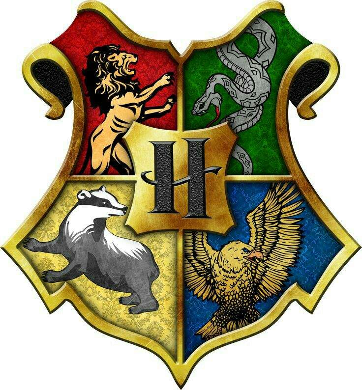

# 🏰 Chapéu Seletor de Hogwarts

  
   
  <em>"Hmm, difícil... muito difícil... Onde devo colocá-lo?"</em>
    
  

## 📜 Carta de Hogwarts

ESCOLA DE MAGIA E BRUXARIA DE HOGWARTS
Diretor: Alvo Dumbledore

Prezado(a) Bruxo(a),

É com grande satisfação que anunciamos a chegada do Chapéu Seletor Digital! 

🔮 **[Acesse o Portal Mágico](https://wellingtonhp22.github.io/Desafio_Chapeu_Seletor_Hogwarts/)**

## 🪄 Encantamentos Disponíveis

### ✨ Magias Principais
- 🎯 Feitiço de Seleção de Casas
- 🌟 Encanto de Revelação de Destino
- 🎭 Transformação Visual Personalizada
- 📜 Pergaminhos Mágicos Animados

## 🧙‍♂️ Como Usar Seus Poderes

### 1. Iniciando sua Jornada
- Digite o nome no campo de texto
- Pressione Enter ou clique em "Selecionar"
- Observe a animação do Chapéu Seletor
- Uma mensagem personalizada revelará a casa escolhida

### 2. Visualizar Bruxos Registrados
- Os bruxos aparecem em uma lista mágica
- Cada entrada mostra o nome e a casa designada
- Efeitos visuais únicos para cada casa

### 3. Revelar Bruxo Escolhido
- Clique no botão "Revelar o Bruxo Escolhido"
- Uma cerimônia mágica acontecerá
- O nome será anunciado com efeitos especiais

## 🛠 Artefatos Mágicos Utilizados
- HTML5 & CSS3 (Estrutura e Estilo)
- JavaScript (Lógica e Animações)
- Google Fonts (Tipografia)
- Git (Controle de Versão)

## 🏰 Casas de Hogwarts

### 🦁 Grifinória
- **Cores**: Vermelho e Dourado
- **Valores**: Coragem, Bravura, Determinação
- **Elemento**: Fogo
- **Fundador**: Godric Gryffindor

### 🦅 Corvinal
- **Cores**: Azul e Bronze
- **Valores**: Sabedoria, Criatividade, Inteligência
- **Elemento**: Ar
- **Fundadora**: Rowena Ravenclaw

### 🦡 Lufa-lufa
- **Cores**: Amarelo e Preto
- **Valores**: Lealdade, Trabalho Árduo, Justiça
- **Elemento**: Terra
- **Fundadora**: Helga Hufflepuff

### 🐍 Sonserina
- **Cores**: Verde e Prata
- **Valores**: Ambição, Astúcia, Liderança
- **Elemento**: Água
- **Fundador**: Salazar Slytherin

